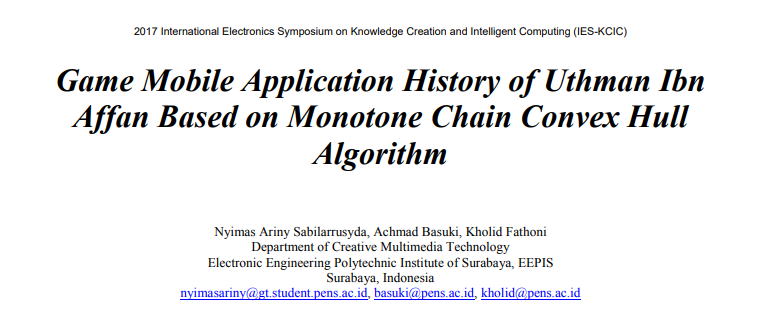
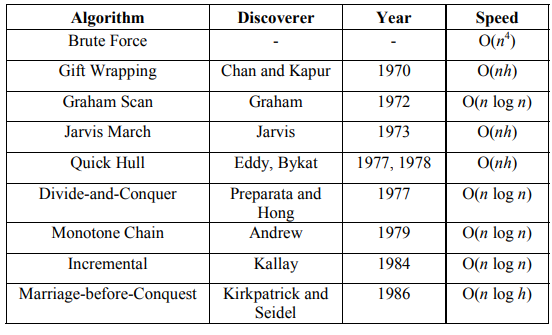

# Paper Review

#### [Paper Source]: Downloaded From IEEE 
#### [Paper Publication/Seminar]: 2017 International Electronics Symposium on Knowledge Creation and Intelligent Computing (IES-KCIC)

## Paper Structure
##### Introduction
##### Basic Theory
##### Detail Discussion
##### Experiment And Analysis
##### Conclusion
##### Reference

## Simple Resume
Uthman Ibn Affan is one of the Companion of theProphet Muhammad Shallallahu 'alaihi wasallam that have many services for Islam in his lifetime. Even though the society is less known about the Uthman Ibn Affan history. This is because too little information facility about the history. Especially, now the tendency of society is more like something that satisfying and interactive, for example is game. So in this paper, the researcher propose the solution to handle the problem that had been explained before. The solution is new model to learn about history of Uthman Ibn Affan based on game. The gameplay of game application uses Monotone Chain Convex Hull algorithm to make game’s gameplay sensedmore interactive. In this game, player must draw an enclosed line for cover certain objects. The Monotone Chain Convex Hull algorithm purpose is to check the selected objects are proper with mission inside the game or not. This game is recommended for elementary age children, so this game’s main target can learn about the history of Uthman Ibn Affan from early with satisfying method. The researcher experimented with trying to play game’s gameplay that have implemented Monotone Chain Convex Hull algorithm in it. The result is the game’s gameplay runs well with a short programming process. the game is also tested by some elementary age children and they give good rating for this game. 
## Introduction
Games that contain history of islamic figures are still rarely circulated in the community. Even the game containing the special content of Uthman Ibn Affan’s history still does not exist. Most Uthman Ibn Affan applications in circulation are still text based. So what is needed is the game application that contains this historical content but still entertaining. Therefore, the researcher created a mobile game app that contains some historical stories of Uthman Ibn Affan such as the story of purchasing the Ruma Well, the management of the Baitul Mal and the collection of Mushaf Al Quran. Gameplay in this game is also made as interactive as possible with gameplay hand on the screen circling objects that must be selected in the game.Checking the position of each of these objects against a circularline created by players based on Monotone Chain Convex Hull algorithm. Based on benchmarking of several convex hull search algorithms, the researcher conclude that Monotone Chain Convex Hull is the most suitable convex hull search algorithm to applied in this game’s gameplay. 

This game application is recommended for elementary age children. This is due to several factors. The first factor is the increasing number of primary school age children that play games, especially mobile games. The second factor is the strength of the child’s memory so the information that provided to them will last long. In-game elements such as visual, gameplay and story will be tailored to the main targets of this app. 

In the making of this game the researcher use Unity software. This mobile game app can only run on Android platform and it is offline, so it does not require any resources from outside the game system. the hope is that this game can become a medium of learning history Uthman ibn Affan for elementary school children. 
## Basic Theory
This algorithm is an algorithm capable of determining the outermost region of a set of points. Then a set of obtained points is formed into a convex hull. The top frame is part of the convex hull that can be seen from above. It runs from the most points on the right to most point on the left in the opposite order clockwise. The bottom frame is the remaining part of the convex hull.
##

##
Graham Scan and Monotone Chain algorithms are two algorithms that work in 2D hull. Both of these algorithms have almost the same speed. Both of these algorithms use ideas and implementations as the same stack. Both of these algorithms are algorithms that work very fast but the Monotone Chain algorithm will work a little faster. Monotone Chain has a more efficient sorting comparison and testing of rejection. 
The initial idea of developing gameplay game that utilizes the Monotone Chain Convex Hull algorithm from Draw A Stickman gameplay game.

## Detail Discussion
#### Scenario Game
   In this game application, there are three stages based on the history of Uthman ibn Affan. The first stage contains the story of purchasing the Ruma’s Well. The second stage contains the management of Baitul Mal. The third stage contains the story of incorporating Quran into one manuscript. Before entering on each stage, there is 2D animation in the form of comic moves.
#### Implementation Monotone Chain Convex Hull in Gameplay Game 
   Contribution in this research is usage Monotone Chain Convex Hull algorithm in gameplay game. The use of this algorithm lies in the process of checking game input gameplay. Inputs are irregularly shaped lines drawn directly by the player through touch on the device screen
## Experiment And Analysis
In this result, the researcher proove thatt raycast Unity also works well. The proof is the only bucket outside the line is detected outside the line. For example, if raycast is unsuccessful and only the Monotone Chain Convex Hull algorithm works then the bucket will be detected inside the line as it is within the convex hull region.

After that, the researcher also tested this game application to some elementary school-aged respondents. The number of respondents is 35 children. The children who are the main target of this game application, like this game. 

## Conclusion
In order to make an islamic-educational game's gameplay feel more interactive, the researcher use the Monotone Chain Convex Hull algorithm to be applied into the game's gameplay. The implementation of this algorithm is intended to allow the program to detect the position of an object in the game against a closed line drawn by a player, whether the object is inside a line or outside. This main concept which will then be developed into various models of gameplay available in the game. For enhancement of object position checking,  the researcher use raycast system provided in Unity. The assessment of the respondents to this game is good. Most of them like this game. 
## Bad and the good
+ The researcher have a good intentions in using the specific history into the game
+ The implementation of Monotone Chain Convex Hull is really effective and well-prooved to check the area that drawn by the player
- the game play did not represent the atmosphere or the real story line in the history 
- There is no a deep analysis, the experiment is just only done through a simple testing and simple cases. 
